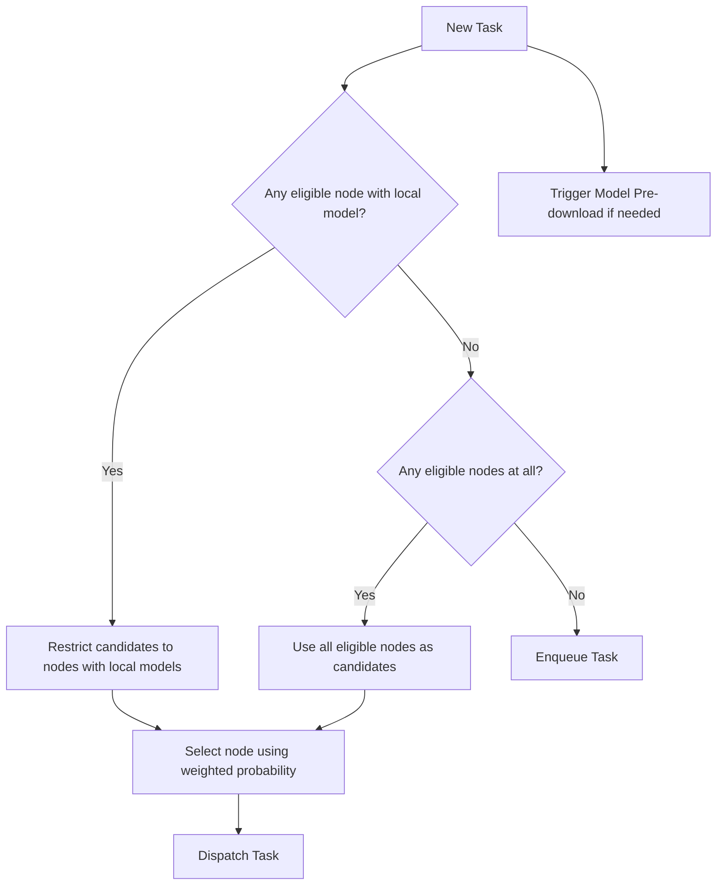

# Task Dispatching

When creating a task, the application can specify criteria such as the minimum VRAM requirement or restrict the node selection to a specific GPU model. The blockchain will identify all eligible nodes that meet the criteria and then randomly select one from these candidates.

If no available nodes meet the criteria, the task will be added to the queue to await more nodes. When a node satisfying the criteria is freed, the highest-price task from the queue will be assigned to this available node.

To optimize task execution speed while maintaining consensus strength, nodes are selected randomly from candidates with different probabilities. Factors influencing a node's selection probability include its local model cache and QoS score. Nodes with faster GPUs, superior networks, fewer timeouts, or locally cached models needed for the task will have a higher likelihood of selection.

## Node Selection Algorithm

The node selection algorithm first determines a pool of candidate nodes, then selects one from the pool using a weighted random process. If no candidates are available, the task is added to the queue.

### Candidate Pool

The nodes on the blockchain are first grouped by their card model, such as the Nvidia RTX 4090 group and the RTX 3080 group. These card model groups are then further grouped by their VRAM size. For example, the 16GB VRAM group may include the RTX 4080, RTX 3080, and RTX 4000 Ada groups. The blockchain will use these card groups to select candidates for a task.

If the application sets `Required GPU` in the task parameters, only the group with the required GPU model will be selected as the candidates. Otherwise, all the groups with VRAM equal to or larger than the task's requirement are chosen as candidates.

To ensure the fastest possible task execution, the system further narrows the candidate pool based on model locality. Crynux Network uses a registry to determine which nodes have already downloaded the required models, and applies the following logic:

- If **at least one** eligible node has the required models locally, the selection is **restricted** to only those nodes with local models. Nodes without local models are excluded from the candidate pool entirely.
- If **no** eligible nodes have the required models locally, the selection falls back to the full set of eligible nodes.

This ensures that tasks are preferentially routed to nodes that can begin execution immediately without downloading models, reducing startup latency for applications.

Additionally, to ensure that enough nodes have in-demand models available, the system triggers a **model pre-download mechanism** every time a task starts. When fewer than 3 available nodes have a required model, additional eligible nodes are prompted to download it proactively. For more details, refer to the following document:


[model-distribution.md](model-distribution.md)


The process is illustrated in the following diagram:

### Selection Weight

Once the candidate pool has been determined, one node is chosen to execute the task. The selection is made through a weighted random process, where each node's probability of being chosen is proportional to a weight calculated from the factors described below. This method ensures that nodes that are better suited for the task are more likely to be selected.

*1. Model Locality Boost*

A task may require one or more models (e.g., a Stable Diffusion task might need a base model plus LoRA models; an LLM task typically needs a single model). The system boosts nodes based on how closely their local state matches the task's requirements to reduce startup latency.

There are two levels of locality:
*   **On-disk locality**: The model is already downloaded to the node's disk. This saves significant time and bandwidth by avoiding downloads.
*   **In-memory locality**: The model is loaded in the GPU memory. This further reduces startup time by skipping the model loading process.

The Model Locality Boost ($$M_i$$) for a node $$i$$ is calculated as:

$$
M_i = 1 + 0.7 \times \frac{localCnt}{total} + 0.3 \times \frac{inUseCnt}{total}
$$

Where:
*   $$localCnt$$ is the number of required models available locally on disk.
*   $$inUseCnt$$ is the number of required models already loaded in GPU memory.
*   $$total$$ is the total number of models required by the task.

This formula gives more weight (0.7) to on-disk locality because avoiding downloads is the primary bottleneck, while in-memory locality provides an additional bonus (0.3).

*2. Staking*

To align a node's economic incentives with the long-term health and security of the network, the amount of staked tokens is a key factor in the selection probability. Nodes with a higher stake are given a higher probability of being assigned tasks.

A Staking Score ($$S_i$$) for a node $$i$$ is calculated by normalizing the square root of its staked amount against the maximum square root of stake in the network:

$$
S_i = \frac{ \sqrt{s_i} } { \max( \sqrt{s_j} \mid j \in N ) }
$$

Where $$s_i$$ is the amount staked by node $$i$$, and $$\max( \sqrt{s_j} \mid j \in N )$$ is the maximum square root of the staked amount among all nodes $$N$$.

This square-root staking dampens the marginal advantage of very large stakes, similar in spirit to quadratic voting. Doubling the stake increases the score by only $$\sqrt{2}$$ rather than 2, which reduces large-holder dominance and helps prevent monopolization, while still rewarding meaningful economic commitment and preserving Sybil resistance.

This design is fundamental to network security, as it significantly raises the cost of a successful Sybil attack. To successfully disrupt the network, an attacker's malicious nodes must be selected to perform tasks. Because the network prioritizes nodes with a higher stake for task assignment, an attacker cannot rely on a large number of cheap, low-stake nodes. Instead, they are forced to consolidate their capital into high-stake nodes just to be considered for selection.

This directly ties the cost of an attack to the cost of controlling the network's most trusted and active participants. It forces the attacker to lock up significant funds in the very nodes they wish to use for malicious purposes, dramatically increasing the economic risk and capital required to disrupt a meaningful portion of the network's operations. This makes the entire system more resilient by making attacks economically impractical.

*3. QoS Score*

A node's performance is determined by its underlying hardware; for example, GPUs with higher clock speeds execute tasks more quickly, and superior network connectivity leads to faster result submission. To encourage faster task execution, Crynux Network prioritizes faster nodes by giving them higher selection probabilities.

To prevent nodes from reporting fake frequencies and GPU models, Crynux Network uses the measured task execution speed rather than self-reported hardware specs. The QoS system produces a single score ($$QoS_i$$, range 0 to 1) for each node that reflects both its long-term performance and short-term reliability. It captures whether a node is consistently fast and whether it is currently dependable. Nodes that frequently time out or perform poorly will see their QoS score drop, reducing their chance of being selected for tasks. For more details on how the QoS score is calculated, see:


[quality-of-service-qos.md](quality-of-service-qos.md)


*4. Final Selection Weight*

The final selection weight for a node is calculated by combining all the scores from the factors above.

To ensure a node is both secure (high stake) and performant (high QoS), the Staking and QoS scores are first combined using the harmonic mean. This method penalizes imbalance; a node cannot compensate for a very low QoS score with a high stake, or vice-versa. The result is then multiplied by the Model Locality Boost.

$$
W_i = \frac{M_i \cdot S_i \cdot QoS_i}{S_i + QoS_i}
$$

Where:

*   $$W_i$$ is the final selection weight for node $$i$$.
*   $$M_i$$ is the node's Model Locality Boost (1 to 2).
*   $$S_i$$ is the node's Staking Score (0 to 1).
*   $$QoS_i$$ is the node's QoS Score (0 to 1), reflecting both long-term performance and short-term reliability.

The probability of a node being selected is then its individual weight divided by the sum of the weights of all candidate nodes. Nodes are selected using weighted random sampling — higher-weighted nodes are more likely to be selected, but any eligible node can be chosen.

If there are not enough candidate nodes to be selected from, the task will be added to the task queue and wait for more nodes to become available.

## Task Queue

Tasks added to the queue are grouped based on VRAM and GPU model requirements. Initially, tasks are sorted into VRAM groups (e.g., 16GB, 24GB). Within these groups, tasks are further categorized by GPU model (e.g., 4090, A100). If no specific GPU model is required, tasks are placed in an "Any" group.

Tasks within the same group are sorted by **task value**. When a task is taken from the queue, the task with the highest value is prioritized. The task value, represented as "CNX per second", is calculated by dividing the task fee by the estimated execution time. For more details on task value estimation, refer to the following document:


[task-pricing.md](task-pricing.md)


### Dequeue a Task for a Newly Available Node

The blockchain will try to retrieve a task from the task queue when a new node becomes available. Which will happen when one of the following situations occurs:

* A running task is finished.
* A new node joins the network.
* A node resumes from the paused status.

> When a new task is sent to the blockchain, it attempts to dispatch the task immediately to the nodes, regardless of the task queue’s status. Tasks remain in the queue only if there are not enough **matching** nodes available. Even if the task queue isn't empty, there might still be available nodes in the network matching the new task, providing a chance for the new task to execute first.

Depending on the GPU model and the VRAM size of the node, the candidate task groups including:

* The task group of the same GPU model
* The "Any" groups that have a equal or smaller VRAM requirement

The first tasks of each candidate group are compared, and the task with the highest value is selected.

### Max Size of the Task Queue

The max size of the task queue is estimated dynamically using the total number of nodes of the network:

$$
S = \alpha * N
$$

Where $$N$$ is the number of nodes in the network, and $$\alpha$$ is a fixed multiplier that will be set as the network parameter.

If the max size is reached, when a new task is sent to the task queue, the task with the lowest task value in the queue will be removed and aborted. The task creator of the removed task will receive the `TaskAborted` event.
